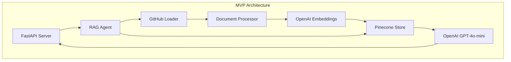

# Knowledge Graph Agent MVP Implementation Plan (2 Weeks)

**Project:** Knowledge Graph Agent  
**Timeline:** 2 Weeks (July 19 - August 2, 2025)  
**Target:** Minimum Viable Product (MVP)  
**Document Version:** 1.0  
**Date Created:** July 19, 2025

## Executive Summary

This implementation plan delivers a focused 2-week MVP for the Knowledge Graph Agent that provides core functionality: indexing GitHub repositories and enabling RAG-based querying through a REST API. The plan prioritizes working software over comprehensive features to meet the tight deadline while establishing a solid foundation for future enhancements.

## MVP Scope Definition

### In Scope (MVP Features)
- ✅ Basic GitHub repository indexing (single repository)
- ✅ Simple document chunking and embedding generation
- ✅ Pinecone vector storage integration
- ✅ Basic RAG query processing with OpenAI
- ✅ Minimal REST API (index and query endpoints)
- ✅ Environment-based configuration
- ✅ Basic error handling and logging

### Out of Scope (Post-MVP)
- ❌ Multiple repository support
- ❌ Advanced chunking strategies
- ❌ Authentication and authorization
- ❌ Comprehensive monitoring and metrics
- ❌ Incremental indexing capabilities
- ❌ Web user interface
- ❌ Advanced error recovery mechanisms
- ❌ Performance optimization and scaling

## Technical Architecture (MVP)

### System Overview


### Technology Stack
- **Backend Framework:** FastAPI
- **AI/ML Framework:** LangChain
- **Vector Database:** Pinecone
- **LLM Provider:** OpenAI (GPT-4o-mini)
- **Embeddings:** OpenAI text-embedding-ada-002
- **Version Control Integration:** GitHub API
- **Configuration:** Pydantic with environment variables
- **Containerization:** Docker

## Project Structure (Simplified)

```
knowledge-graph-agent/
├── src/
│   ├── config/
│   │   └── settings.py              # Environment configuration
│   ├── loaders/
│   │   └── github_loader.py         # GitHub repository content extraction
│   ├── processors/
│   │   └── document_processor.py    # Text processing and chunking
│   ├── vectorstores/
│   │   └── pinecone_store.py        # Pinecone integration
│   ├── agents/
│   │   └── rag_agent.py             # RAG pipeline implementation
│   └── api/
│       └── main.py                  # FastAPI application
├── requirements.txt                 # Python dependencies
├── .env.example                     # Environment variables template
├── Dockerfile                       # Container configuration
├── main.py                          # Application entry point
└── README.md                        # Quick start guide
```

## Implementation Timeline

### Week 1: Core Infrastructure & Document Processing

#### **Day 1-2: Project Foundation**

**Task 1.1: Basic Project Setup (4 hours)**
- Create minimal project directory structure
- Initialize Python project with essential packages
- Set up version control and basic documentation
- Configure development environment

**Task 1.2: Dependency Management (2 hours)**
- Create `requirements.txt` with core dependencies:
  - fastapi
  - langchain
  - pinecone-client
  - openai
  - python-dotenv
  - pydantic
  - uvicorn

**Task 1.3: Environment Configuration (6 hours)**
- Implement `src/config/settings.py` with Pydantic models
- Support for OpenAI, Pinecone, and GitHub credentials
- Create `.env.example` with required variables
- Add basic validation and error handling

#### **Day 3-4: GitHub Integration & Document Processing**

**Task 1.4: GitHub Repository Loader (8 hours)**
- Implement `src/loaders/github_loader.py`
- GitHub API integration for content extraction
- Support single repository with configurable file extensions
- Basic file content retrieval and metadata extraction
- Handle authentication with GitHub tokens

**Task 1.5: Document Processing Pipeline (8 hours)**
- Create `src/processors/document_processor.py`
- Implement text cleaning and preprocessing
- Simple recursive character text splitter
- Fixed chunk size (1000 chars) with 200 char overlap
- Metadata preservation (file path, repository info)

#### **Day 5: Vector Storage Setup**

**Task 1.6: Pinecone Integration (8 hours)**
- Implement `src/vectorstores/pinecone_store.py`
- Pinecone client setup and index management
- Document embedding using OpenAI text-embedding-ada-002
- Batch upsert functionality for storing embeddings
- Basic error handling for connection and API issues

### Week 2: RAG Pipeline & API Development

#### **Day 6-7: RAG Implementation**

**Task 2.1: Basic RAG Agent (10 hours)**
- Create `src/agents/rag_agent.py`
- Implement simple query processing workflow
- Vector similarity search in Pinecone
- Context retrieval (top-k results)
- OpenAI GPT-4o-mini integration for response generation

**Task 2.2: Prompt Engineering (6 hours)**
- Design system prompt template for code queries
- Implement context injection for retrieved documents
- Basic response formatting and source attribution
- Handle edge cases (no results, insufficient context)

#### **Day 8-9: API Development**

**Task 2.3: REST API Implementation (12 hours)**
- Create `src/api/main.py` with FastAPI
- Implement core endpoints:
  - `POST /index` - Index a GitHub repository
  - `POST /query` - Query the knowledge base
  - `GET /health` - Health check endpoint
- Basic request/response models with Pydantic
- Error handling and structured logging

**Task 2.4: Integration Testing (4 hours)**
- End-to-end workflow testing
- Validation with sample repository
- Query accuracy verification
- Basic load testing

#### **Day 10: Deployment & Documentation**

**Task 2.5: Deployment Preparation (4 hours)**
- Create simple Dockerfile for containerization
- Docker compose setup for local development
- Environment variable documentation
- Basic deployment instructions

**Task 2.6: MVP Documentation (4 hours)**
- Quick start guide in README.md
- API usage examples and documentation
- Configuration reference
- Basic troubleshooting guide

## API Specification

### Environment Configuration

```bash
# LLM Configuration
OPENAI_API_KEY=your_openai_api_key
LLM_MODEL=gpt-4o-mini
EMBEDDING_MODEL=text-embedding-ada-002

# Vector Database
PINECONE_API_KEY=your_pinecone_api_key
PINECONE_INDEX_NAME=knowledge-graph-mvp

# GitHub Configuration
GITHUB_TOKEN=your_github_token
GITHUB_FILE_EXTENSIONS=.py,.js,.md,.json,.yml,.yaml,.txt

# Application Settings
CHUNK_SIZE=1000
CHUNK_OVERLAP=200
MAX_RESULTS=5
```

### Core API Endpoints

#### 1. Index Repository
```http
POST /index
Content-Type: application/json

{
  "repository_url": "https://github.com/owner/repo",
  "branch": "main"
}

Response:
{
  "status": "success",
  "message": "Repository indexed successfully",
  "documents_processed": 42,
  "chunks_created": 156,
  "embeddings_stored": 156
}
```

#### 2. Query Knowledge Base
```http
POST /query
Content-Type: application/json

{
  "question": "How does the authentication work in this codebase?",
  "max_results": 5
}

Response:
{
  "status": "success",
  "answer": "Based on the codebase analysis...",
  "sources": [
    {
      "file_path": "src/auth/authentication.py",
      "chunk_text": "def authenticate_user(username, password)...",
      "relevance_score": 0.85
    }
  ],
  "query_time_ms": 1250
}
```

#### 3. Health Check
```http
GET /health

Response:
{
  "status": "healthy",
  "services": {
    "pinecone": "connected",
    "openai": "connected"
  },
  "index_stats": {
    "total_vectors": 156,
    "last_updated": "2025-07-19T10:30:00Z"
  }
}
```

## Success Criteria

### Functional Requirements
- ✅ Successfully index a GitHub repository (< 1000 files)
- ✅ Process and embed documents in Pinecone vector database
- ✅ Return relevant results for basic code-related queries
- ✅ API responds within 10 seconds for typical queries
- ✅ Handle basic error scenarios gracefully

### Quality Gates
- ✅ End-to-end workflow works with sample repository
- ✅ API returns structured responses with source attribution
- ✅ System handles at least 10 concurrent requests
- ✅ Basic logging implemented for debugging
- ✅ Deployment instructions work on clean environment

### Performance Targets (MVP)
- **Query Response Time:** < 10 seconds (95th percentile)
- **Indexing Speed:** 100+ files per minute
- **API Availability:** > 95% uptime during testing
- **Relevance Quality:** > 70% of queries return useful results

## Risk Management

### Technical Risks & Mitigation

| Risk | Impact | Probability | Mitigation Strategy |
|------|--------|-------------|-------------------|
| GitHub API rate limits | High | Medium | Implement basic retry logic, use test repositories |
| Pinecone quota exceeded | High | Low | Monitor usage, implement cost controls |
| OpenAI API failures | Medium | Low | Add basic retry mechanisms, graceful fallbacks |
| Integration complexity | Medium | Medium | Early integration testing, simple implementations |
| Scope creep | High | High | Strict adherence to MVP feature list |

### Timeline Risks & Mitigation

| Risk | Impact | Probability | Mitigation Strategy |
|------|--------|-------------|-------------------|
| Feature complexity underestimated | High | Medium | Choose simplest implementation approach |
| Testing time insufficient | Medium | High | Combine development and testing activities |
| Deployment issues | Medium | Medium | Test deployment early and often |
| Documentation delays | Low | Medium | Minimal but sufficient documentation |

## Testing Strategy

### Unit Testing (Minimal for MVP)
- Core business logic validation
- Configuration loading and validation
- Basic error handling verification
- Test coverage target: > 60% for critical paths

### Integration Testing
- GitHub API integration with test repositories
- Pinecone vector operations with test index
- OpenAI API integration with development quotas
- End-to-end API workflow validation

### Manual Testing Scenarios
1. **Repository Indexing**: Index a small public repository
2. **Query Processing**: Ask various types of code-related questions
3. **Error Handling**: Test with invalid inputs and network failures
4. **Performance**: Basic load testing with concurrent requests

## Post-MVP Roadmap

### Week 3-4: Enhanced Features
- Multi-repository support and management
- Basic authentication and API key system
- Improved chunking strategies for different file types
- Performance optimization and caching

### Week 5-6: Production Readiness
- Comprehensive monitoring and logging
- Advanced error handling and recovery
- Incremental indexing capabilities
- Security hardening and validation

### Week 7-8: Advanced Capabilities
- Web user interface for easier interaction
- Advanced query types and filters
- Analytics and usage metrics
- API rate limiting and quota management

## Getting Started

### Prerequisites
- Python 3.9+
- Docker (optional for containerization)
- GitHub account with API access
- Pinecone account with API key
- OpenAI account with API access

### Quick Setup
1. Clone repository and install dependencies
2. Copy `.env.example` to `.env` and configure
3. Run `python main.py` to start the API server
4. Use `/index` endpoint to index a test repository
5. Use `/query` endpoint to ask questions about the code

### Sample Repository for Testing
We recommend using a small, well-documented repository for initial testing:
- **Size:** < 100 files
- **Language:** Python or JavaScript
- **Documentation:** Good README and code comments
- **Complexity:** Moderate (not too simple, not too complex)

## Conclusion

This 2-week MVP implementation plan delivers a functional Knowledge Graph Agent that demonstrates core value while providing a solid foundation for future development. The focus on essential features and simplified architecture ensures we can meet the deadline while delivering working software that can be iteratively improved.

The success of this MVP will be measured by its ability to accurately answer basic questions about indexed codebases and provide a smooth user experience through the REST API. Post-MVP iterations will focus on scalability, security, and advanced features based on user feedback and requirements.