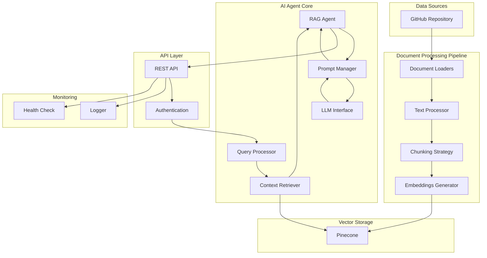
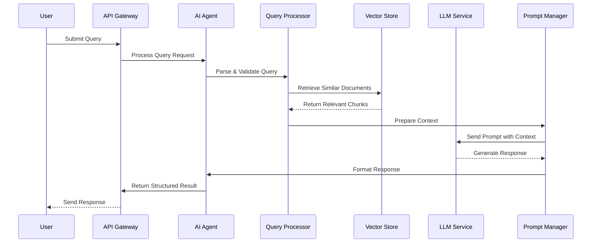
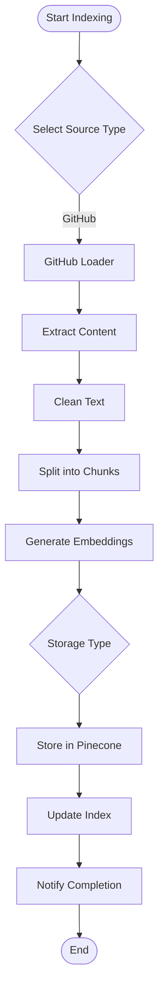

# Knowledge Graph Agent Document

## Overview
This document outlines the overview of an AI Agent with RAG (Retrieval-Augmented Generation) capabilities to index and query codebases from GitHub repositories. The agent will provide intelligent responses based on the indexed knowledge base.

## Requirements
- Load all settings from environment file (.env)
- Index all documents and files in GitHub Repository based on list of URLs provided in `appSettings.json` using Github MCP tool
- Using Python language for AI Agent
- Using LangChain framework to build AI Agent, and LangGraph to manage workflows
- Integration with LLM models (e.g.OpenAI...)
- Using vector database with Pinecone

## Architecture Overview

### System Components
1. **Document Loaders**: Extract content from various sources (GitHub, Github Enterprise)
2. **Text Processors**: Clean, chunk, and prepare documents for vectorization
3. **Vector Store**: Store and retrieve document embeddings
4. **LLM Interface**: Handle queries and generate responses
5. **RAG Pipeline**: Orchestrate retrieval and generation processes
6. **API Layer**: Provide REST endpoints for interaction

### Data Flow

#### System Architecture Diagram


#### Query Processing Flow


#### Document Indexing Flow


## Implementation Details

### 1. Project Structure
```
knowledge-graph-agent/
├── src/
│   ├── agents/
│   │   ├── __init__.py
│   │   ├── base_agent.py
│   │   ├── rag_agent.py
│   ├── loaders/
│   │   ├── __init__.py
│   │   ├── github_loader.py
│   ├── processors/
│   │   ├── __init__.py
│   │   ├── document_processor.py
│   │   └── chunking_strategy.py
│   ├── vectorstores/
│   │   ├── __init__.py
│   │   ├── base_store.py
│   │   ├── pinecone_store.py
│   ├── llm/
│   │   ├── __init__.py
│   │   ├── llm_factory.py
│   │   ├── embedding_factory.py
│   │   ├── openai_llm.py
│   ├── config/
│   │   ├── __init__.py
│   │   └── settings.py
│   ├── utils/
│   │   ├── __init__.py
│   │   ├── logging.py
│   │   └── helpers.py
│   └── api/
│       ├── __init__.py
│       ├── routes.py
│       ├── models.py
│       └── middleware.py
├── tests/
│   ├── unit/
│   ├── integration/
│   ├── e2e/
│   └── performance/
├── docs/
│   ├── api/
│   ├── deployment/
│   └── user-guide/
├── scripts/
│   ├── setup.sh
│   ├── deploy.sh
│   └── migrate.py
├── requirements.txt
├── requirements-dev.txt
├── .env.example
├── docker-compose.yml
├── docker-compose.prod.yml
├── Dockerfile
├── .gitignore
├── .github/
│   └── workflows/
│       ├── ci.yml
│       └── cd.yml
└── main.py
```

### 2. Environment Configuration

#### .env Configuration
```bash
# LLM Configuration
LLM_PROVIDER = openai
LLM_MODEL = gpt-4o-mini
LLM_API_BASE_URL=https://api.openai.com/v1

OPENAI_API_KEY=your_openai_api_key

# Embedding Configuration
EMBEDDING_PROVIDER=openai
EMBEDDING_MODEL=text-embedding-ada-002

# Vector Database Configuration
PINECONE_API_KEY=pinecone-api-key
PINECONE_COLLECTION_NAME=knowledge-base-graph

# GitHub Configuration
GITHUB_TOKEN=your_github_token
GITHUB_FILE_EXTENSIONS=[".cs",".csproj",".py",".php",".js",".jsx",".ts",".tsx",".html",".cshtml",".md",".json",".yml",".yaml",".csv","dockerfile",".sh",".bash"]

# Application Configuration
APP_ENV=development #production
LOG_LEVEL=INFO #DEBUG
CHUNK_SIZE=1000
CHUNK_OVERLAP=200
MAX_TOKENS=4000
TEMPERATURE=0.9
```

## References
- https://python.langchain.com/docs/tutorials/rag/
- https://langchain-ai.github.io/langgraph/tutorials/workflows/#building-blocks-the-augmented-llm
- https://docs.pinecone.io/guides/get-started/quickstart

